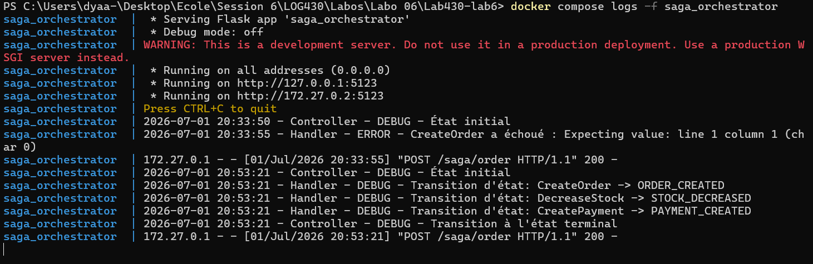
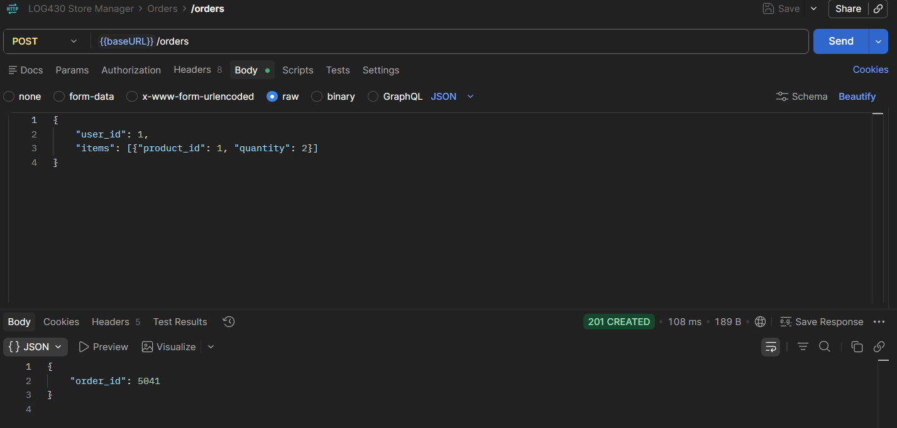

Dyaa Abou Arida

# Rapport Labo 6

**Question 1 : Lequel de ces fichiers Python représente la logique de la machine à états décrite dans les diagrammes du document arc42? Est-ce que son implémentation est complète ou y a-t-il des éléments qui manquent? Illustrez votre réponse avec des extraits de code.**

Le fichier qui représente la logique de la machine à états est src/controllers/order_saga_controller.py, car il garde l’état courant dans self.current_saga_state et fait avancer la saga selon cet état. On voit la transition entre START, ORDER_CREATED, STOCK_DECREASED, PAYMENT_CREATED, puis END. L’implémentation n’est pas complète, car la partie DeleteOrderHandler est encore indiquée comme un TODO, alors que le labo demande de l’ajouter pour compléter la saga.

Code de order_saga_controller:

    while self.current_saga_state is not OrderSagaState.END:
        if self.current_saga_state == OrderSagaState.START:
            self.logger.debug("État initial")
            self.current_saga_state = self.create_order_handler.run()
        elif self.current_saga_state == OrderSagaState.ORDER_CREATED:
            self.decrease_stock_handler = DecreaseStockHandler(self.create_order_handler.order_id, order_data['items'])
            self.current_saga_state = self.decrease_stock_handler.run()
        elif self.current_saga_state == OrderSagaState.STOCK_DECREASED:
            self.create_payment_handler = CreatePaymentHandler(self.create_order_handler.order_id, order_data)
            self.current_saga_state = self.create_payment_handler.run()

1.1 Capture d'écran des logs de saga orchestrator

---

**Question 2 : Est-ce que le handler CreateOrderHandler connecte à une base de données directement pour créer des commandes? Illustrez votre réponse avec des extraits de code.**

Non, CreateOrderHandler ne se connecte pas directement à une base de données. Il appelle plutôt le service Store Manager à travers l’API Gateway avec une requête HTTP POST. Donc la création réelle de la commande reste dans le microservice store_manager, pas dans l’orchestrateur.

Code de CreateOrderHandler:

    response = requests.post( f'{config.API_GATEWAY_URL}/store-manager-api/orders', json=self.order_data, headers={'Content-Type': 'application/json'} )

---

**Question 3 : Quelle requête dans la collection Postman du Labo 05 correspond à l'endpoint appelé par CreateOrderHandler? Illustrez votre réponse avec des captures d'écran ou extraits de code.**

La requête Postman du Labo 05 correspondante est la création de commande : POST /store-manager-api/orders. C’est exactement l’endpoint appelé dans CreateOrderHandler. Dans notre test local, l’appel à http://localhost:8081/store-manager-api/orders a retourné un order_id, ce qui confirme que l’endpoint est le bon.

3.1 Requête Postman de la creation de commande

---

**Question 4 : Quel endpoint avez-vous appelé pour modifier le stock? Quelles informations de la commande avez-vous utilisées? Illustrez votre réponse avec des extraits de code.**

J’ai appelé l’endpoint POST /store-manager-api/stocks via l’API Gateway pour modifier le stock. Les informations utilisées sont les items de la commande, donc chaque product_id avec sa quantity, ainsi que l’opération "-" pour diminuer les quantités. Si l’appel échoue, le handler déclenche un rollback en supprimant la commande créée précédemment.

Code de decrease_stock_handler:

    response = requests.post(
        f'{config.API_GATEWAY_URL}/store-manager-api/stocks',
        json={
            "items": self.order_item_data,
            "operation": "-"
        },
        headers={'Content-Type': 'application/json'}
    )

---

**Question 5 : Quel endpoint avez-vous appelé pour générer une transaction de paiement? Quelles informations de la commande avez-vous utilisées? Illustrez votre réponse avec des extraits de code.**

J’ai appelé POST /payments-api/payments via l’API Gateway pour créer la transaction de paiement. Avant cela, j’ai appelé GET /store-manager-api/orders/{order_id} pour récupérer le total_amount de la commande. Les informations utilisées sont donc order_id et le montant total de la commande.

Code de create_payment_handler:

    payment_response = requests.post(
        f'{config.API_GATEWAY_URL}/payments-api/payments',
        json={
            "order_id": self.order_id,
            "amount": self.total_amount
        }
    )

---

**Question 6 : Quelle est la différence entre appeler l'orchestrateur Saga et appeler directement les endpoints des services individuels? Quels sont les avantages et inconvénients de chaque approche? Illustrez votre réponse avec des captures d'écran ou extraits de code.**
